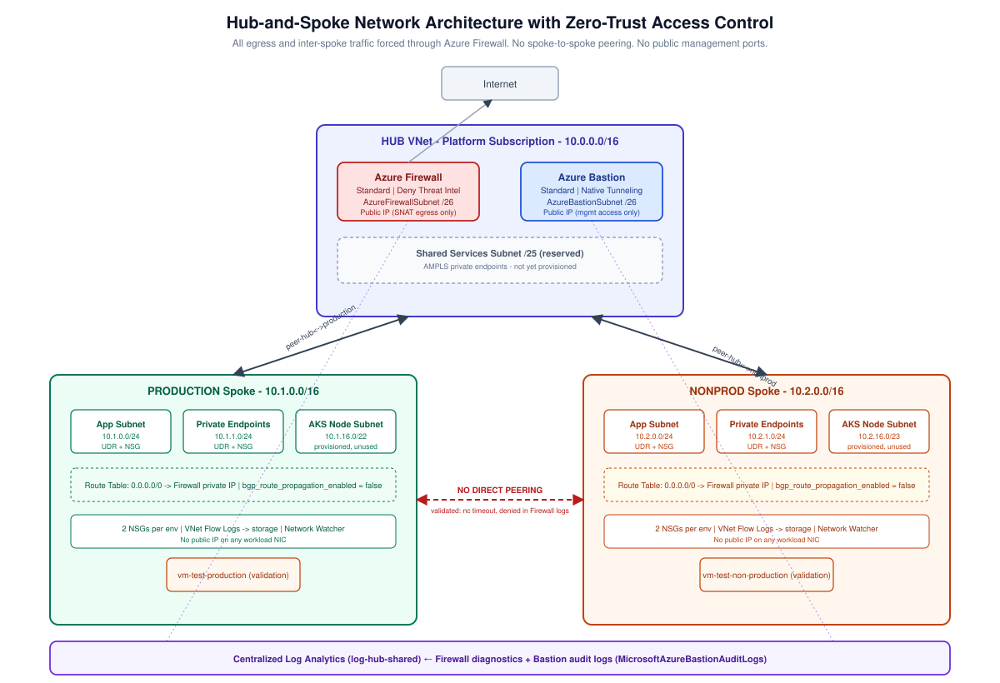
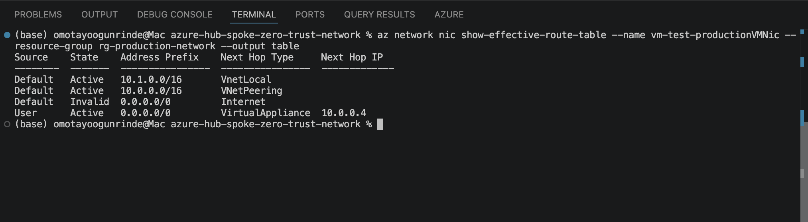
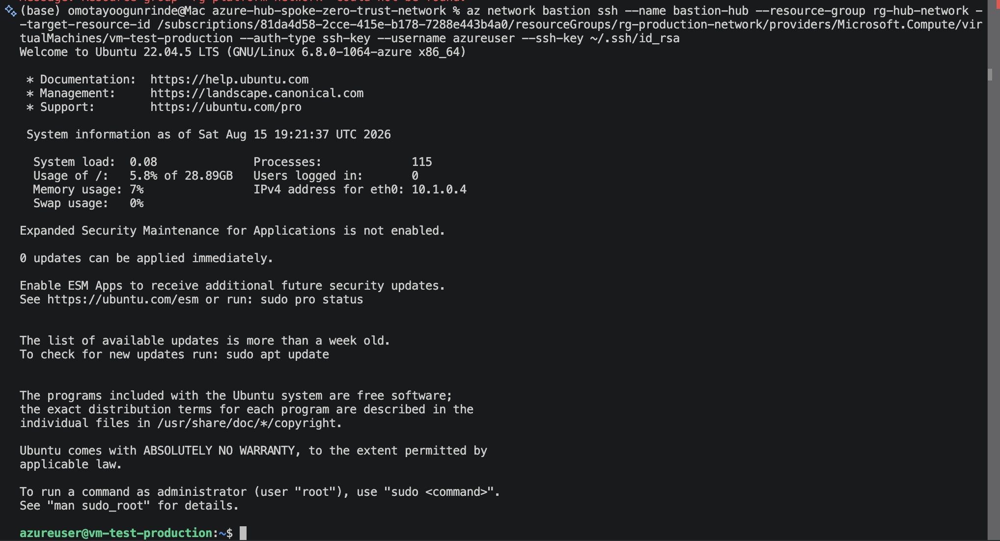
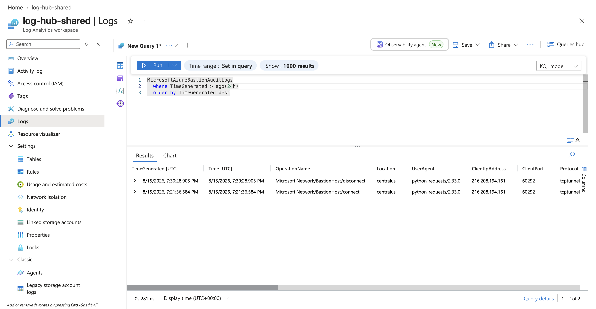
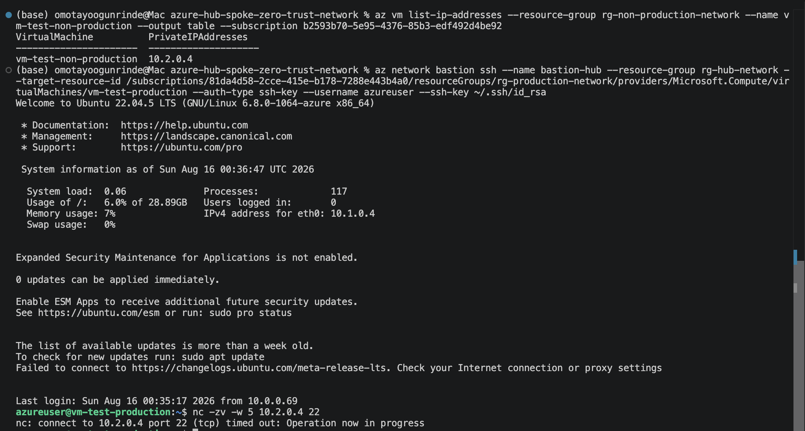
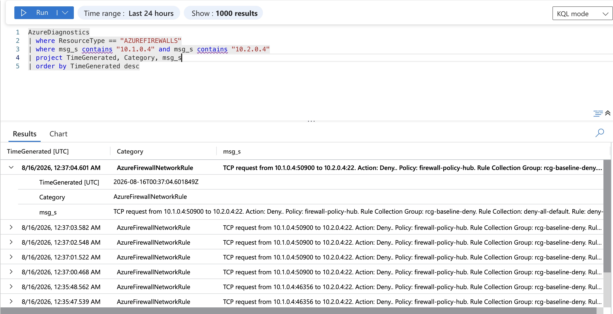
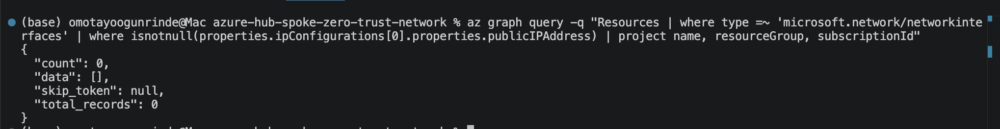

# Azure Hub-and-Spoke Network Architecture with Zero-Trust Access Control

This project extends a Multi-Subscription Landing Zone with a hub-and-spoke network topology, centralized traffic inspection, and zero-trust access control across Production and NonProd environments - deployed against three real Azure subscriptions, validated end-to-end, and documented with the actual evidence.



## Table of Contents

- [Overview](#overview)
- [Zero-Trust Controls](#zero-trust-controls)
- [Architecture](#architecture)
- [Address Plan](#address-plan)
- [Repository Structure](#repository-structure)
- [Prerequisites](#prerequisites)
- [Deployment](#deployment)
- [Validation Evidence](#validation-evidence)
- [Real-World Issues Encountered](#real-world-issues-encountered)
- [Cost Considerations](#cost-considerations)
- [Known Scope Boundaries](#known-scope-boundaries)

## Overview

A hub VNet in the Platform subscription hosts Azure Firewall (Standard, Deny-mode threat intelligence) and Azure Bastion (Standard, native client tunneling). Production and NonProd spoke VNets peer to the hub; every subnet in both spokes is forced through the firewall via user-defined routes, with no direct spoke-to-spoke shortcut and no public management ports anywhere in the environment.

This isn't just a `terraform plan` exercise - it was deployed against three live subscriptions under real organizational governance (tag policies, allowed-SKU policies, allowed-locations policies inherited from the Landing Zone project), hit and resolved genuine Azure timing/propagation issues, and was independently validated post-deployment with real test workloads. See [Validation Evidence](#validation-evidence) and [Real-World Issues Encountered](#real-world-issues-encountered) for the specifics.

## Zero-Trust Controls

| Requirement | Implementation | Verified by |
|---|---|---|
| All egress forced through inspection | UDR `0.0.0.0/0` to Firewall private IP on every subnet, `bgp_route_propagation_enabled = false` | Effective route table pulled from a live VM NIC - Evidence #1 |
| No direct spoke-to-spoke traffic | No spoke-to-spoke peering exists; only hub-to-spoke both directions | Direct connection attempt from Production to NonProd timed out; confirmed denied in Firewall logs - Evidence #4, #5 |
| Threat traffic blocked, not just logged | Firewall Policy `threat_intelligence_mode = Deny` | Firewall network rule logs show real denied traffic, including background VM telemetry - Evidence #5 |
| No public SSH/RDP | Zero public IPs on workload NICs; access only via Bastion (Standard, tunneling enabled) | Resource Graph query + per-subscription public IP inventory - Evidence #6 |
| Session activity centrally logged | Bastion connect/disconnect events shipped to Log Analytics | Matched connect/disconnect audit log entries for a real session - Evidence #3 |
| PaaS services not publicly exposed | Private endpoint subnets reserved per spoke, `private_endpoint_network_policies = Enabled` | Subnet configuration in Terraform state |
| Defense in depth | NSGs (explicit deny-all-inbound) layered under UDR enforcement, not relied on alone | NSG + route table both present per subnet |
| No stored credentials for Azure auth | OIDC / workload identity federation, `use_oidc = true` in the backend and provider config | No client secret present anywhere in this repo |

## Architecture

- **Hub VNet** (Platform subscription): `AzureFirewallSubnet`, `AzureBastionSubnet`, and a reserved shared-services subnet for future monitoring private endpoints.
- **Production and NonProd spokes**: app subnet, private-endpoints subnet, and a fully provisioned AKS node subnet (route table + NSG already attached) reserved for a future AKS deployment.
- **Bidirectional peering**, `allow_forwarded_traffic = true` on all four peering legs.
- **Centralized Log Analytics workspace**: Firewall and Bastion diagnostics land here, giving this environment a real observability baseline from day one. VNet flow logs write raw data to per-spoke storage (Traffic Analytics is blocked by governance policy - see Decisions).

Full reasoning for every decision, including the real deployment issues that shaped the final design, is in [`DECISIONS.md`](./DECISIONS.md).

## Address Plan

| Environment | VNet CIDR | Key Subnets |
|---|---|---|
| Hub (Platform) | `10.0.0.0/16` | Firewall `10.0.0.0/26`, Bastion `10.0.0.64/26`, shared services `10.0.0.128/25` |
| Production | `10.1.0.0/16` | App `10.1.0.0/24`, private endpoints `10.1.1.0/24`, AKS `10.1.16.0/22` (provisioned, unused) |
| NonProd | `10.2.0.0/16` | App `10.2.0.0/24`, private endpoints `10.2.1.0/24`, AKS `10.2.16.0/23` (provisioned, unused) |
| Reserved | `10.3.0.0/16` | Future DR/secondary region |

`10.0.0.0/8` is reserved as one supernet, allocated per environment, to leave room for future expansion (additional environments, a DR region) without CIDR collisions.

## Repository Structure

```
.
├── backend.tf                  # Remote state - shared storage account, project-specific key
├── providers.tf                # Provider versions + 3 subscription-scoped azurerm aliases
├── variables.tf                # Root inputs: subscriptions, region, tags, CIDR plan
├── main.tf                     # Wires log-analytics, hub, spoke x2, peering x2 together
├── outputs.tf                  # Firewall/Bastion IDs, peering state, workspace IDs
├── terraform.tfvars.example    # Template for required per-deployment values
├── modules/
│   ├── hub/                    # VNet, Firewall + Policy, Bastion
│   ├── spoke/                  # VNet, subnets, NSGs, forced-tunneling route table, flow logs
│   ├── peering/                # Bidirectional hub<->spoke peering (dual-subscription)
│   └── log-analytics/          # Centralized workspace
├── screenshots/                # Screenshots proving each zero-trust control
├── DECISIONS.md                # Full decision log, including real debugging narrative
└── README.md
```

## Prerequisites

- Terraform >= 1.9.0, AzureRM provider ~> 4.81
- Three Azure subscriptions (Platform, Production, NonProd) under the existing Landing Zone management group hierarchy
- OIDC-based authentication configured (workload identity federation) - no client secrets used anywhere in this project
- Existing remote state storage account (`omotayotfstate` / `rg-tfstate` / `canadacentral`)
- Azure CLI, authenticated, for validation steps

**Note on region:** `var.location` defaults to `canadacentral`, but this project's actual reference deployment (every screenshot in this README) used `centralus`, set via `terraform.tfvars`. The variable exists specifically so the deployment region isn't hardcoded into the modules - set it to whatever fits your own subscription/policy constraints.

## Deployment

```bash
cp terraform.tfvars.example terraform.tfvars
# edit terraform.tfvars with real subscription IDs

terraform init
terraform plan
terraform apply
```

## Validation Evidence

Every control claimed above was independently tested post-deployment against real infrastructure, not just asserted from the Terraform code.

### Test Summary

| # | Test | Why | Method | Result |
|---|---|---|---|---|
| 1 | Effective routes check | Proves forced tunneling is real, not just configured in code | `az network nic show-effective-route-table` against a live VM NIC | `0.0.0.0/0` resolves to `VirtualAppliance`, next-hop matches Firewall's private IP |
| 2 | Bastion SSH connection | Proves SSO-gated access works for a VM with zero public IP | `az network bastion ssh`, native client tunneling | Successful shell session |
| 3 | Egress test (`curl` from inside the VM) | Sanity check that became a live test of deny-by-default | `curl ifconfig.me` from the Bastion session | Hung / no response |
| 4 | Firewall log check for the egress deny | Confirms the firewall actively blocked it, not a broken connection | KQL against `AzureDiagnostics` (`AZUREFIREWALLS`) | Matching deny entry found |
| 5 | Bastion audit log query | Proves session activity is centrally logged | KQL against `AzureDiagnostics` | No results - led to Test 6 |
| 6 | Bastion Portal connection + table discovery | Isolated whether logging was a native-client-specific gap | Portal connection, then searched workspace Tables blade | Found dedicated `MicrosoftAzureBastionAuditLogs` table; connect/disconnect events matched |
| 7 | Blocked spoke-to-spoke test | The core zero-trust claim: no direct path between spokes | `nc -zv -w 5 <nonprod-ip> 22` from the Production VM | Timed out, no connection |
| 8 | Firewall log check for the spoke-to-spoke deny | Confirms the firewall specifically denied it | KQL filtered for both VMs' private IPs | Exact matching deny entry found |
| 9 | Public IP exposure check | Proves zero public management ports across the whole environment | Resource Graph query + per-subscription public IP inventory | Zero public IPs on any workload NIC |
| 10 | VM IP configuration check | Direct confirmation the test VM itself has no public IP | `az vm list-ip-addresses` | Private IP only |

Tests 3 and 6 started as incidental findings, not planned steps - a hung `curl` and a missing log query - and turned into genuine evidence once investigated, rather than being dismissed as noise.

### Detailed Evidence

**1. Forced tunneling - effective routes**



Pulled directly from a live VM's NIC via `az network nic show-effective-route-table`. The `0.0.0.0/0` route resolves to `VirtualAppliance` with next-hop IP matching the Firewall's private address - not a direct route to the internet.

**2. SSO-gated access - Bastion connection**



Live SSH session via `az network bastion ssh` (native client tunneling), zero public IP on the target VM at any point in the path.

**3. Centralized session logging**



Matched connect/disconnect events for the session above, queried from `MicrosoftAzureBastionAuditLogs` - discovered during validation that Bastion logs route to this dedicated table rather than the shared `AzureDiagnostics` table (see Decisions).

**4. Blocked-by-design - spoke-to-spoke**



Direct connection attempt from the Production test VM to the NonProd test VM's SSH port timed out - no spoke-to-spoke peering exists, and no firewall rule permits this traffic.

**5. Firewall actively denying real traffic**



Firewall network rule logs showing denied traffic - both the deliberate spoke-to-spoke test and incidental background traffic from the VMs themselves, confirming the deny-all baseline blocks everything not explicitly allowed, not just the test traffic.

**6. Zero public management exposure**



Resource Graph query across all workload NICs, plus a per-subscription public IP inventory - confirms the only public IPs in the entire environment belong to the Firewall and Bastion themselves.

## Real-World Issues Encountered

Deploying against a live, governed environment surfaced genuine problems beyond syntax - each diagnosed and resolved, not worked around:

- **Required-tag governance policy blocked the first `apply` outright** - traced to a missing tag key in the shared tag map, not a location or resource issue.
- **Traffic Analytics enablement blocked by policy** - root-caused to a hidden, auto-provisioned Microsoft-managed resource that Terraform has no way to tag, not a bug in this project's code.
- **Azure CLI `--tags` gaps on certain resource types** - worked around with ARM template deployment for full control over the request payload.
- **Resource Manager propagation delays** causing intermittent `ResourceGroupNotFound` on freshly-created resource groups - fixed with an explicit, documented `time_sleep` pattern.
- **A real race condition in peering creation** while spoke subnets were still provisioning - fixed with explicit module-level `depends_on`, not just implicit output references.
- **Bastion subnet teardown timing** against its own hidden backend infrastructure during a `destroy`.

Full technical detail on each, including root cause and fix, is in [`DECISIONS.md`](./DECISIONS.md).

## Cost Considerations

- Azure Firewall Standard is the dominant fixed cost (hourly deployment charge, independent of traffic volume) - not left running continuously outside active use.
- Log Analytics ingestion capped at 1 GB/day as a hard backstop against a misconfigured diagnostic setting generating unexpected billing.
- No availability zones configured on Firewall/Bastion for this lab - accepted trade-off, documented as a production gap rather than an oversight.

## Known Scope Boundaries

- Ingress (internet-to-workload) is out of scope - this project covers egress and inter-spoke enforcement; an ingress story (Application Gateway or Firewall DNAT) would be needed for any workload requiring internet-facing access.
- Intra-VNet (subnet-to-subnet within one spoke) traffic is enforced by NSGs only, not the Firewall - a deliberate, documented distinction.
- Log Analytics ingestion/query uses public endpoints; Private Link (AMPLS) is deferred, with address space already reserved for it.
- Traffic Analytics is disabled due to a governance policy constraint (see Decisions) - flow logs still capture raw data to storage.
- No TLS inspection (Firewall Premium) - not required for this project's threat model.
